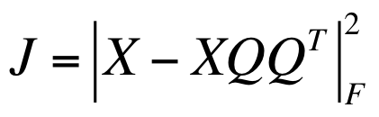

# Autoencoders

## 1. Basic Autoencoder

Supervised machine learning models have the same API - 2 functions

* train(X, Y) for fit(X, Y) for training
* predit(X) for prediting

Antoencoder is a neural network that predicts itself

* train(X, X) or fit(X, X)) for training
* predict(X) or transform(X) for transforming X to its hidden representation

Object loss function:

* We can use **Mean Squared Error** if X can be any real values
* We can use **Cross Entropy**
	* For X in \[0, 1] (this is range)
	* Or X in {0, 1} (this is set)
* Think of images (e.g., MNIST) as pixel intensities
	* 0 = no intensity
	* 1 = max intensity
	* We always scale by 255
* Use sigmoid at hidden layer and output layer so things are always in [0, 1]
* Autoencoder pseudocode

```
 # compute the hidden representation
 Z = sigmoid(X.dot(W_h) + b_h)
 # reconstruct the input X
 X_hat = sigmoid(Z.dot(W_o) + b_o)
```

* Shared weights
	* Using shared weights is kind of regulization because we are reducting the number of parameters.

```
 Z = sigmoid(X.dot(W_h) + b_h)
 X_hat = sigmoid(Z.dot(W_o) + b_o)
```

Objective Function


This is similar to objective function of PCA. 




Therefore, antonecoder are like nonlinear PCA. It is a nonlinear mapping just list how t-SNE is a nonlinear mapping

Differences:

* No bias, no requirement that column of W has length l, orthogonality, order.

## 2. Denoising Autoencoders

* Can always modify and append data to imporve generalization
	* Given a dataset, we do not have to just train on that dataset. 
	* e.g., upside-down cat is still a cat, sideways cat is still a cat, shifted cat, etc.

* Can also explicitly add noise
	* One way is to add gaussian noise to input: X + epsilon, epsilon ~ N(0, small numer)
	* Another way is to simply set some of the values to zero.


## 3. Stacked Autoencoders

* Create multiple autoencoders and put them together in layers
* Basic algorithm
	* You have the input data X
	* Train an autoencoder on X, the hidden layer's output is Z1
	* Train an autoencoder on Z1 (target is Z1), the hidden lyyer's output is Z2

* We want each layer to be a more compact representation than than last, so each layer will decrease in size.

* Note that each time, we "discard" the 2nd half of the autoencoder, we only care about the inner representation at Z

## Greedy Layer-wise  Pretraining

* The algorithm we talked about in section 3 is called greedy layer wise pre-training
* Theoretically, it is not optimal, but helps a lot with supervised learning 
* Last step:
	* Add logistic regression layer to the end
* Now it is a deep neural network. 
	* Because the logistic layer has randomly initialized weights, we still need to do some backpropergation to train these weights. 
	* But it does not take as long as pure backpropergation, because autoencoders already put in near the right answer. This step is called "fine tunning"