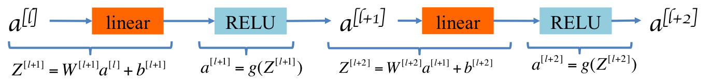
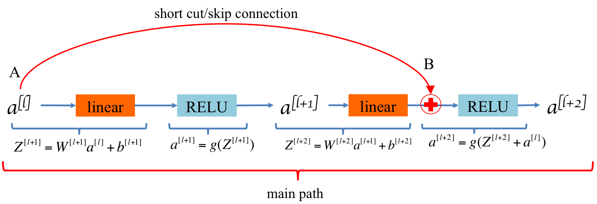
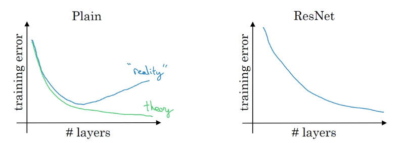

# Residual Networks

In recent years, neural networks have become deeper, with state-of-the-art networks going from just a few layers (e.g., AlexNet) to over a hundred layers.

> The main benefit of a very deep network is that it can represent very complex functions. It can also learn features at many different levels of abstraction, from edges (at the lower layers) to very complex features (at the deeper layers). 

> However, using a deeper network doesn't always help. A huge barrier to training them is <b>vanishing (or exploding) gradients</b>: very deep networks often have a gradient signal that goes to zero quickly, thus making gradient descent unbearably slow. More specifically, during gradient descent, as you backprop from the final layer back to the first layer, you are multiplying by the weight matrix on each step, and thus the gradient can decrease exponentially quickly to zero (or, in rare cases, grow exponentially quickly and "explode" to take very large values). 

## Residual block

ResNets can deminish the issue of vanishing gradients to some extend and thus it makes deep neural network easier to train. This is achieved by residual blocks. In a residual block, a "shortcut" or a "skip connection" allows to fast forward information multiple layers ahead and to backpropagate gradient directly to earlier layers.

Figure 1 shows a block without 'skip connection':

<caption>
 <u>  **Figure 1** </u>  : A block without a **skip-connection**   
</caption>

Figure 2 shows a residual block:

<caption>
 <u>  **Figure 2** </u>  : **A residual block**   
</caption>
    
In this residual block, information can flow directly from point A to point B through the 'short cut' rather than going through all these steps through the main path. On the other way around, gradients can be propagated back directly from point B to point A. 

In this residual block (called `identity block` to be more precise), we calculate $a^{[l+2]}$ by $g(Z^{[l+2]} + a^{[l]})$ instead of $g(Z^{[l+2]})$ assuming that $Z^{[l+2]}$ and $a^{[l]}$ has the same dimension:

$$ a^{[l+2]} = g(Z^{[l+2]} + a^{[l]}) $$

If they have different dimension, we can multiply $a^{[l]}$ with a matrix $W_s$ to transform $a^{[l]}$ to have the same dimension as that of $Z^{[l+2]}$. Then, we have formular:

$$ a^{[l+2]} = g(Z^{[l+2]} + W_s a^{[l]}) $$

For Convoluational Neural Network, we achieve this by adding a convolutional layer to the 'short cut'. In this case, this residual block is called `convolutional block`. 

The way we build a ResNet is by taking many residual blocks and stacking them together to form a deep neural network.

## What is good about residual blocks for deep network?

If we train a deep network that has no residual blocks, in theory, as we make the network deeper, the network should only perform better and better on the training data. However, In reality, we would find that as we increase the number of layes, the training error will tend to decrease for a while but then it will tend to go back up. 

In ResNet, as the number of layers gets larger, we can have the performance of the training error keep on going down. Even if we train a network with over hundreds of layers.

<caption>
 <u>  **Figure 3** </u>  : **Training error comparison**   
</caption>

## Why do ResNet work?

Suppose we have a deep neural network, called A:
    

<caption>
 <u>  **Figure 4** </u>  : ** A deep neural network**   
</caption>

We append a residual block to network A:

<caption>
 <u>  **Figure 5** </u>  : ** A deep neural network appended a residual block**   
</caption>

We use Relu activation. We have the output:
    $$ a^{[l+2]} = g(Z^{[l+2]} + a^{[l]}) = g(W^{[l+2]}a^{[l+1]} + b^{[l+2]} + a^{[l]})$$

if $W^{[l+2]}$ and $b^{[l+2]}$ are trained to be 0, then we learned a identity function (because $g(.)$ is Relu):
    $$ g(a^{[l]}) = a^{[l]} $$

What this shows is that the identity function is easy for residual network to learn. It easy to get $a^{[l+2]} = a^{[l]}$ because of the skip connection. Adding a residual block to network A does not really hurt A's ability to performance as well as network A when it has no residual block.

> Our objective is not just not hurt the performance of the network. We hope that the residual blocks would learn something more useful making the deep neural network as a whole do even better than just learning identity functions.

What the issue with very deep neural network without residual blocks is that: when we make the network deeper and deeper, it is very difficult for the network to choose parameters that learn the identity functions. This is why a lots of layers end up making the result worse rather then making the result better.

## References 

This notebook presents the ResNet algorithm due to He et al. (2015). The implementation here also took significant inspiration and follows the structure given in the github repository of Francois Chollet: 

- Kaiming He, Xiangyu Zhang, Shaoqing Ren, Jian Sun - [Deep Residual Learning for Image Recognition (2015)](https://arxiv.org/abs/1512.03385)
- Francois Chollet's github repository: https://github.com/fchollet/deep-learning-models/blob/master/resnet50.py
