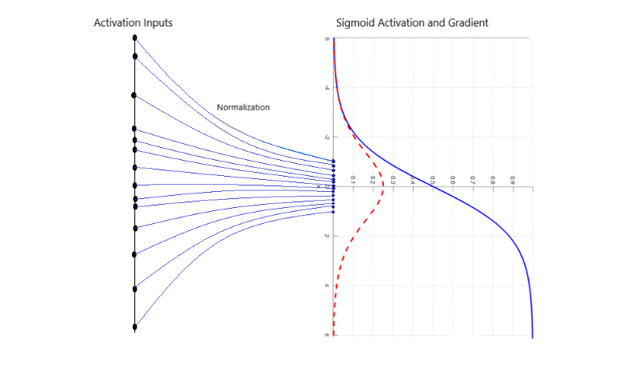
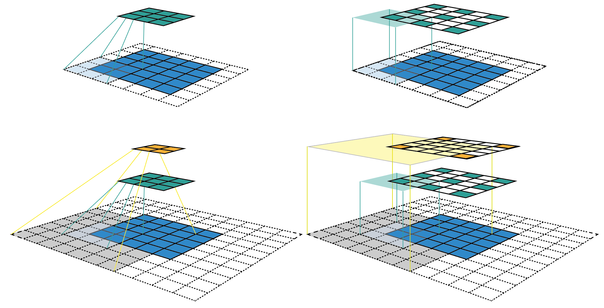
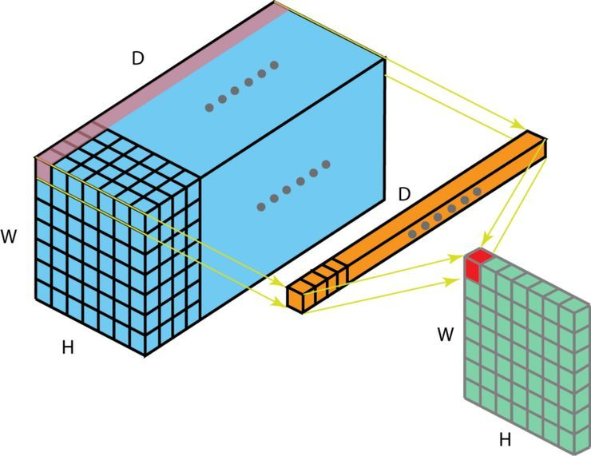
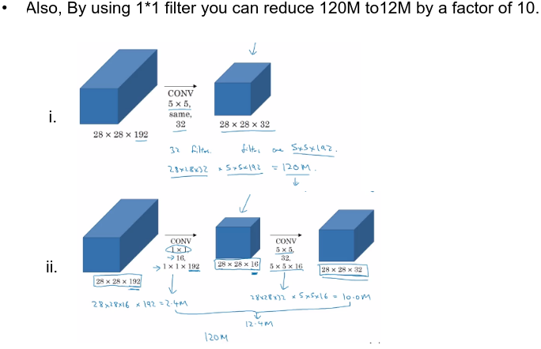
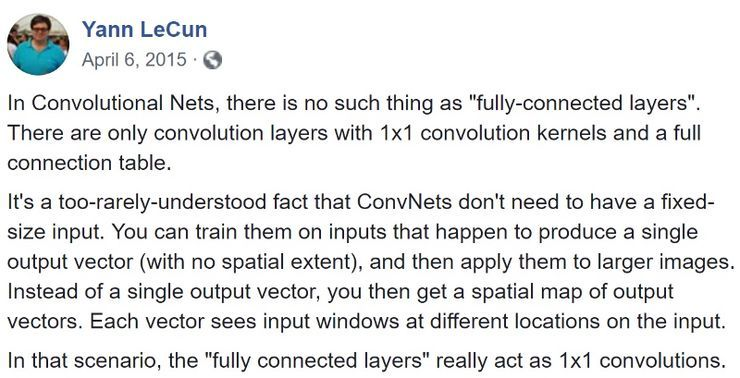

### 池化层 （Pooling layer）

* 提取明显的特征
	* max pooling 抽取最主要的特征。一定程度提高了对特征提取的平移不变形，从而提高了模型对特征的鲁棒性。
	* average pooling 对背景的捕捉
* 对输入特征图在面（长x宽）上进行降维。也即，向下采样。

### 激活函数 （activation function） 

* add non-linearity to neural networks

### 内部协变量偏移（Internal Covariate Shift)

什么是内部协变量偏移？

* 这个问题是系统性，第一层参数发生变化，将导致第二层输入的分布发生变化。这样的变化传递下去，后面层输入分布的改变将可以放大，从而后面层输入分布可能严重偏移开始的数据分布。训练过程中，神经网络中间层数据分布的改变叫做内部协变量偏移

这样学习的模式是不固定的，因为各层数据的分布在改变。导致的后果：

* 跨层激活后的分布发生变化
* 陷入饱和区，学习效率低下
* 最佳学习率的变化=>只能采取比较小的步长。

这个问题在机器学习中就是独立同分布问题：

独立同分布假设IID (Independent and Identically Distributed), 就是假设训练数据和测试数据是满足相同分布的。这是通过训练数据获得的模型能够在测试数据上获得好的效果的一个基本保障。

* 独立： 每次抽样之间没有关系，不会相互影响。
* 同分布：每次抽样，样本服从同一个分布。

IID 在大部分情况下都是作为假设直接用的，很少有人去验证。

因此协变量偏移（Covariate Shift）存在于：

* 训练数据和测试数据遵循不同分布。
* 分布式机器学习中，各节点拥有的数据分布不相同。
* 神经网络中下一层与上一层遵循不同的分布（也叫内部协变量偏移）。

解决方案是批量归一化（[Batch Normalization](https://towardsdatascience.com/intuit-and-implement-batch-normalization-c05480333c5b)）

* 让神经网络的每一层的输入数据更加可控和标准化（规范化）。这样以规范化的方式传递消息有助于提供一致的传递方式。这一方法叫批量归一化（Batch Normalization）

> Batch normalization transforms layer outputs into a unit Gaussian distribution. As these outputs are fed through an activation function, layer activations will also become more normally distributed. Since the output of one layer is the input of the next, layer inputs will now have significantly less variation from batch to batch. By reducing the varied distribution of layer inputs we solve the first problem.

### 感受野 ([Receptive Field](https://medium.com/mlreview/a-guide-to-receptive-field-arithmetic-for-convolutional-neural-networks-e0f514068807))

* 生物学上将感受野定义为：“刺激导致特定感觉神经元反应的区域”。
* 在神经网络中，感受野是神经元的属性，而不是刺激的属性。

感受野的直观感受：

层次越深，感受野越大

影响感受野的因素：

* 第一层卷积层的输出特征图像素的感受野的大小等于滤波器的大小。
* 深层卷积层的感受野的大小和它之前所有层的滤波器大小和步长有关系。
* 计算感受野大小时，不受图像填充边缘影响。

### 1x1 卷积

在设计高质量深度神经网络模型时，最常用的方式是增加网络的宽度和深度。但这容易导致两个缺陷：

* 参数太多。在训练数据有限的情况下，容易出现过拟合。
* 网络越大，计算复杂度越高。

怎么设计一个高效的网络结构在提高网络的宽度和深度，从而提高模型容量的情况下，又不使网络参数过多？1x1卷积就是一个即简单又有效的工具。

从(i)多通道卷积和(ii)特征图映射数量两个方面讨论:

#### 多通道卷积

一个滤波器必须具有与输入特征图相同的通道数或深度。卷积前后的通道数不同，**卷积后的输出特征图的通道数或者深度由滤波器的个数决定的**，和输入特征图的通道数没有关系。

* 一个滤波器生成一个单通道的特征图。
* N个滤波器生成N个通道的特征图。

#### 特征映射太多的问题

深度学习模型常见的设计模式，就是滤波器数量通常随着网络的加深而增加。滤波器越多导致特征映射的数量越多。每一层的输出特征图的通道数就会增加。

* 池化层不会改变模型中滤波器的数量，也即输出特征图通道的数量。
* 深度卷积神经网络需要相应的类似池化的层来减少特征图的通道数（深度）。

1x1卷积的直观感受：

下图阐述了 1 x 1 卷积在一个维度为 H x W x D 的输入层上的操作方式。经过大小为 1 x 1 x D 的过滤器的 1 x 1 卷积，输出通道的维度为 H x W x 1。如果我们执行 N 次这样的 1 x 1 卷积，然后将这些结果结合起来，我们能得到一个维度为 H x W x N 的输出层。

* **本质上说1x1卷积是对输入特征图在通道维度上的线性加权**。换句话说，1x1卷积对输入特征图进行了抽象总结（通过线性加权）。
* 1x1滤波器的卷积层可以用于卷积神经网络中的任何点以控制特征映射（滤波器）的数量 （减少或增加）。
* 被称作投影操作，通道池化。

> 1 x 1 卷积最初是在 Network-in-network 的论文（论文阅读地址：https://arxiv.org/abs/1312.4400）中被提出的，之后在谷歌的 Inception 论文（论文阅读地址：https://arxiv.org/abs/1409.4842）中被大量使用。

1 x 1 卷积具有如下几个优势：

* 进行更有效率的低维度嵌入，或者对特征通道进行池化；
* 减少输出特征图通道数量以实现更有效率的计算；
* 卷积以后反复应用非线性特征。

前两个优势我们可以从上面的图像中观察到。执行 1 x 1 卷积后，我们明显减少了维度的深度级别。假设原始输入有 200 个通道，1 x 1 卷积会将这些通道（特征）嵌入到一个单通道中。第三个优势在 1 x 1 卷积执行后才显现出来，它会将线性整流函数（ReLU）等非线性激活函数添加进模型中。非线性特征让网络学习更复杂的函数。

谷歌的 Inception 论文中也对这些优势进行了描述：

> One big problem with the above modules, at least in this naive form, is that even a modest number of 5x5 convolutions can be prohibitively expensive on top of a convolutional layer with a large number of filters.

> This leads to the second idea of the proposed architecture: judiciously applying dimension reductions and projections wherever the computational requirements would increase too much otherwise. This is based on the success of embeddings: even low dimensional embeddings might contain a lot of information about a relatively large image patch... **1x1 convolutions are used to compute reductions before the expensive 3x3 and 5x5 convolutions**. Besides being used as reductions, they also include the use of rectified linear activation which makes them dual-purpose.

1针对 1 x 1 卷积，Yann LeCun 提出了一个非常有趣的角度：「在卷积网络中，不存在像「全连接层」这样的东西，而只有含有一些 1x1 卷积核和 1 个全连接表的卷积层」

Also read:

* [What does 1x1 convolution mean in a neural network?](https://stats.stackexchange.com/questions/194142/what-does-1x1-convolution-mean-in-a-neural-network)

