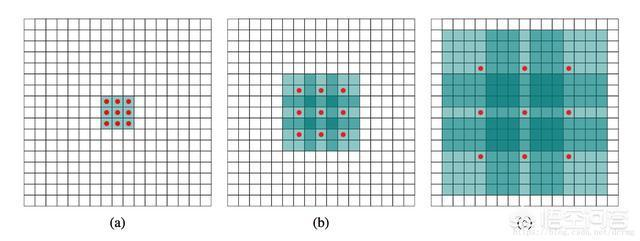

# 如何理解空洞卷积 dilated convolution？

## 一般卷积

首先，我们要知道，空洞卷积是什么，和一般的卷积操作有什么不同？

### 一般的卷积层的卷积操作是什么样？

一般的卷积操作就不仔细说了，看下面的动图，这是padding=1,stride=1的卷积操作示意图，外圈白色区域是padding。从下图看出，输入层和输出层经过卷积操作后，尺寸没变，都是5*5. 但卷积神经网络提取特征是一个下采样的过程。

### 网络为什么需要下采样？

1.减小特征的尺寸，从而减小网络的参数量，防止网络过拟合

2.提取更好的特征，获得更好的性能

### 一般卷积神经网络中下采样由什么操作完成？

一般的卷积网络中下采样都是通过池化（pooling）层得到的。常常使用pooling操作，包括average pooling和max pooling。其作用在仿照人的视觉系统进行降维，同时扩大了感受野（perceptual field）。对卷积层提取的特征进行降采样，从而能够获取到更高级的特征。此外pooling层也可以保证特征位置和旋转不变形。最后引入pooling还能起到降少网络参数，防止过拟合的问题。一般设计卷积神经网络时，都会在卷积操作后加上池化层。

池化层优点：能够增大感受野减小模型参数缓解过拟合

池化层缺点: 通过这样直接pooling的操作，在一定程度上损失了空间结构信息。

## 空洞卷积

空洞卷积（dilated convolution）就是为解决pooling层的缺点而提出的。它首先是针对图像语义分割而产生的一种卷积方法。不同于一般的卷积，空洞卷积的卷积核更加“蓬松”，也就是在卷积核中加入空洞，以此来扩大感受野。引入了一个新的参数空洞率（dilation rate), 即卷积核的间隔数目，正常卷积核的空洞率等于1。

### 空洞卷积操作如何进行？

空洞卷积如下图所示，它可以看做利用一个参数，将原本的卷积核中间填充0，扩大卷积核的大小，利用扩充的卷积核进行卷积操作。从图中所示，空洞卷积也能扩大网络感受野减小尺寸同时还能保留一定的结构空间信息。

如下图就是一个空洞率为2的3*3空洞卷积。我们可以发现，空洞卷积不仅扩大了感受野降低了维度，同时没有增加计算量。

但是由于引入了一个超参数，就需要权衡每次卷积时的参数，如果空洞率过大，那么就很有可能捕捉不到图像中小物体的信息，因此再使用时需要设置好合适的空洞率。此外，如果叠加多个空洞率为2的3*3卷积核，那么就会出现网格效应（the gridding effect），丢失了大量信息。因此在设计空洞卷积时，需要考虑不同层设置不同的空洞率，这样就能够让卷积操作尽可能的获得到最多的信息。

