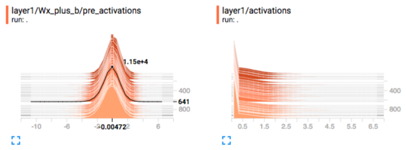
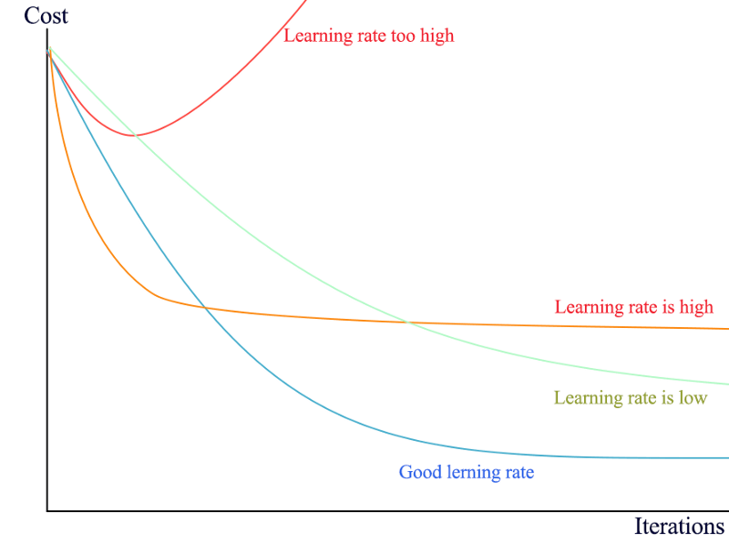

# Debug a Deep Learning Network (Part 5)

You have build a deep network (DN) but the predictions are garbage. How are you going to troubleshoot the problem? In this article, we describe some of the most common problems in a deep network implementation. But if you have not read the `Part 4: Visualize Deep Network models and metrics`, please read it first. We need to know what to look before fixing anything.

## General Troubleshoot tips for Deep Learning

> **1 . Start with clean data and transform them into good shape**

* Visualize and verify the input data (after data pre-processing and before feeding to the model).
* Verify the accuracy of the input labels (after data shuffle if applicable).
* Do not feed the same batch of data over and over.
* Scale your input properly (likely between -1 and 1 and zero centered).
* Verify the range of your output (e.g. between -1 and 1).
* Always use the mean/variance from the training dataset to rescale the validation/testing dataset.
* All input data to the model has the same dimensions.
* Access the overall quality of the dataset. (Are there too many outliners or bad samples?)
* No data augmentation.

> **2. Start with simple model and put it in good shape. Focus on verifying the model is functioning. Monitor the changes of parameters**

Deep Learning (DL) training composes of million iterations to build a model. Locate bugs are hard and it breaks easily. Start with something simple and make changes incrementally. Model optimizations like regularization can always wait after the code is debugged.

* Set the regularization factors to zero. No other regularization (including dropouts). Dropout in inference and testing should be always off.
* Use the Adam optimizer with default settings.
* Use ReLU activation.
* Fewer layers.
* Scale your input data but no un-necessary pre-processing.
* The model parameters are initialized correctly. The weights are not set all the same or all to 0.
* Monitor histogram of the activations or gradients to debug diminish/explode. 
* Monitor weights to check weights that are mostly zero or too large.
* Verify and test your loss function.
* For pre-trained model, your input data range matches the range used in the model.

> **3. Overfit the model with a small amount of training data, small mini-batch and short iterations/epochs to get quick feedback.**
 
If the loss does not drop within a few thousand iterations, debug the code further. Achieve your first milestone by beating the odds of guessing. Then make incremental modifications to the model: add more layers and customization. Train it with the full training dataset. Add regularizations to control the overfit by monitor the accuracy gap between the training and validation dataset. **If stuck, take out all bells and whistles and solve a smaller problem**.

> **4. Use default initial hyperparameters**

Many hyperparameters are more relevant to the model optimization. Turn them off or use default values. Use Adam optimizer. It is fast, efficient and the default learning rate does well. Early problems are mostly from bugs rather from the model design or tuning problems. 

## More detail on Troubleshoot

### Weight initialization

Initialize the weights to all zeros is one of the most common mistakes and the DN will never learn anything. Weights should be initialized with a Gaussian distribution.

### Loss function

Verify and test the correctness of your loss function. The loss of your model must be lower than the one from the random guessing. For example, in a classification problem with 10 classes, the cross entropy loss for random guessing is -ln(1/10).

For the first implementations, avoid using multiple data cost functions. The weight for each cost function may be in different order of magnitude and will require some efforts to tune it. If we have only one cost function, it can be absorbed into the learning rate.

### Monitor histogram of activation and gradients

Scaling and normalization are well-understood but remain one of the most overlook problems. If input features and nodes output are normalized, the model will be much easier to train. If it is not done correctly, the loss will not drop regardless of the learning rate. 

We should monitor the histogram for the input features and the nodes’ outputs (before the activation functions), activations, and/or gradients collected over a large amount of training iterations (maybe one epoch) for each layer. 

The preactivation value of hidden units can tell us if the units saturate, or how often they do. In a deep network where the propagated gradients quickly grow or quickly vanish, optimization may be hampered. 

Always scale input properly. For the nodes’ outputs, the perfect shape is zero-centered with values not too large(positively or negatively). If not and we encounter gradient problems in that layer, apply batch normalization for convolution layers and layer normalization for RNN cells

### Keep tracking of Shape/Dimension

Always keep track of shape of the Tensor (matrix) and document it inside the code. This is a very useful technique to check if you are using the framework API correctly or building the model correctly. 

The shape is framework-dependent. Therefore, you have to go through the framework API document to make sure you understand how to use those API.

For example, for a Tensor with shape [N, channel, W, H ], if W (width) and H (height) are swapped, the code will not generate any error if both have the same dimension. Therefore, we should unit test our code with a non-symmetrical shape. For example, we unit test the code with a [4, 3] Tensor instead of a [4, 4] Tensor.

### Analyze training and test error

It is often difficult to determine whether the model is correctly implemented. You can obtain some clues from the training and test errors. 

If the training errors is low but the test error is high, then it is likely that the training procedure works correctly, and the model is overfitting for fundamental algorithmic reasons. Or the test error is measured incorrectly because of some reasons. 

If both training and test errors are high, then it is diffcult to determine whether there is a implementation defect or whether the model is underfitting due to fundamental algorithmic reasons. This scenario requires further test.

### Visualize the model in action

Directly observing the model performing its task will help to determine whether the quantitative performance numbers it achieves seem reasonable. Evaluation bugs can be some of the most devasting bugs because they can mislead you into believing your system is performing well when it is not.

### Visualize the worst mistakes

Most models are able to output some sort of confidence measure for the task they  perform. For example, classifers based on a softmax output layer assign a probability to each class. 

Typically, maximum likelihood training results in these value being overestimates rather than accurate probabilities of correct prediction, but they are somewhat useful in the sense that examples that are actually less likely to be correctly labeled receive smaller probabilities under the model. By viewing the training set examples that are the hardest to model correctly, one can often discover problems with the way the data have been preprocessed or labeled. 

### Frozen variables

When we use pre-trained models, we may freeze those model parameters in certain layers to speed up computation. Double check no variables are frozen in-correctly.

### Unit testing

As less often talked, we should unit test core modules so the implementation is less vulnerable to code changes. Verify the output of a layer may not be easy if its parameters are initialized with a randomizer. Otherwise, we can mock the input data and verify the outputs. For each module (layers), We can verify

* the shape of the output in both training and inference. 
* the number of trainable variables (not the number of parameters).

### Learning Rate

If loss still does not drop after verifying the checklist, tune the learning rate. If the loss drops too slow, increase the learning rate by 10. If the loss goes up or the gradient explodes, decrease the learning rate by 10. Repeat the process until the loss drops gradually and nicely. Typical learning rates are between 1 and 1e-7.

