# Object Detection

## Outline
* Object localization (how to combine classification and regression)
* Localization -> Detection
* Sliding windows efficient implementation
* Intersection over Union
* Non-Max suppression
* YOLO (You Only Look Once)
* SSD (Single-shot multiBox Detector)

## Object Localization

* This is the problem of not just determining whether or not an object is in an image but also its location
	* What is the object if any, and where is it?
	* Typically, just one big object in the middle of the image that you are trying to recognize and localize.
	* Object detection involves multiple objects

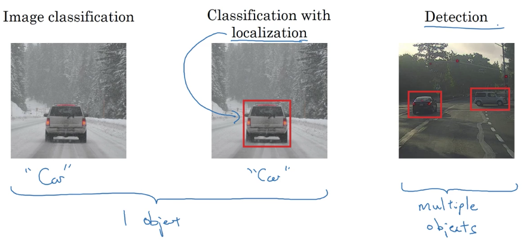</img>

* Typically, this is done using bounding boxes (rectangles). But can also be ellipses or facial keypoints (landmark detection)
* We do not just want to know WHAT, we want to know WHERE

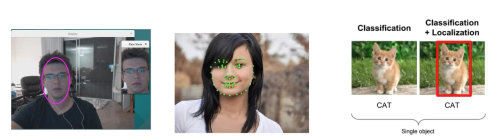</img>

* Object localization is first step towards understanding object detection
* Even if object localization is not the final goal, it can still improve classification accuracy
	* So you may want to use it even if only doing classification
	* Intuitively, it may be because the neural network features are forced to "look at" the area of the image where the object is

## Thought on detecting objects in an image
* Object detection problem involves multiple objects (can be 0 object) in an image. It should detect all objects if any and localize them all.
* It mush be fast because we need to be able to detect objects in real time
* Worth thinking about: what kind of data structures do we need?
	* CNN outputs fixed set of numbers
	* But an image may have 0 objects, or it many have 50. How can CNN outputs the right numbers for all cases?
	* Naive strategy:
		* In a loop (until no object can be found with confidence beyoud the predefined threshold):
			* Look for object with highest class confidence
			* Output its p(class | img), cx, cy, height and width
			* Erase that object from the image

## Sliding windows detection
* Sliding window detection algorithm aims to detect and localize all objects in an image. It first predefines windows (square boxes) of different sizes and then slides each window across the entire image and classify every square region with some stride as containing the object (e.g. car) or not. 
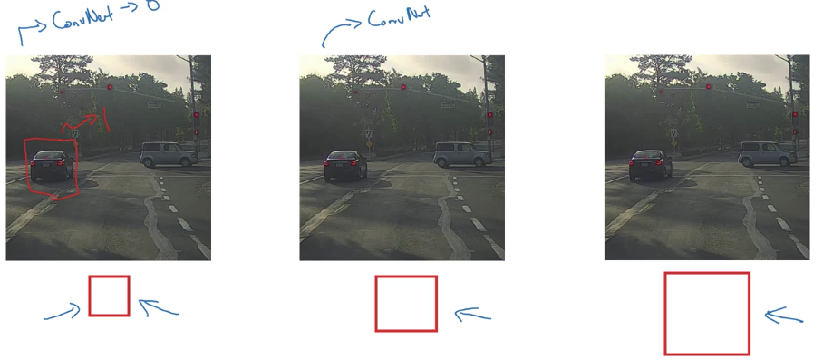</img>

* Sliding windows detection algorithm utilizes a pretrained classifier to detect objects. This classifier is trained using closely cropped images, meaning that each training image pretty much only contains the object. 

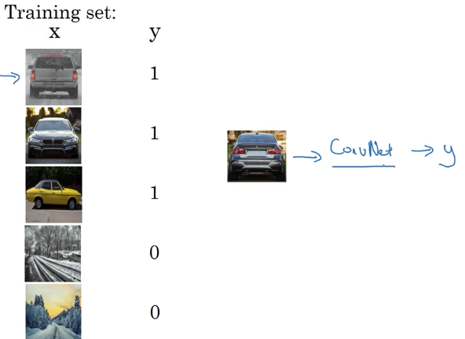</img>

* pseudocode for sliding window detection algorithm

```
for i in range(H):
	for j in range(W):
		i1 = i * stride
		i2 = i1 + window_size
		j1 = j * stride
		j2 = j1 + window_size
		window = img[i1:i2, j1:j2]
		prediction = CNN.predict(window)
```
* A huge disadvantage of sliding window detection
	* It is computational expensive. Because, you are cropping out so many square regions in the image and running each of them independently through a ConvNet
	* If you are using very coarse stride, this will reduce the number of windows you need to pass through the ConvNet. However, this coarser granularity may hurt the performance. On the other hand, if you are using very fine granularity of stride, huge amount of windows need to be passing through the ConvNet, which means a very high computational cost.

## Convolutional sliding window
### Turning FC layer into Convolutional layers

</img>

* Instead of flattening the 5-5-16 image, we convolve 5-5-16 image with 400 5-5-16 filters (i.e., 5-5-16-400) to get 1-1-400 feature map.
* Then, we are using 1-1-400-400 convolutional layer to get the next 1-1-400 feature map.
* Finally, we are using 1-1-400-4 convolutional layer to get the final 1-1-4 feature map followed by softmax activations.

### Convolution implementation of sliding window

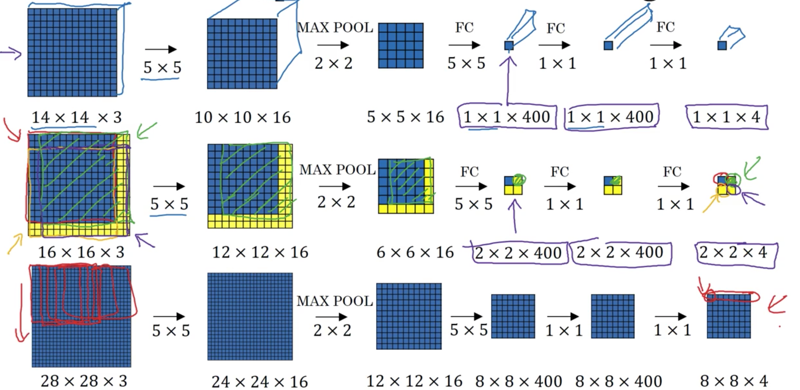</img>

## Anchor Boxes

* Anchor boxes help detect multiple objects in one grid cell.
* We are using following 3 by 3 grid image as an example.
 <center>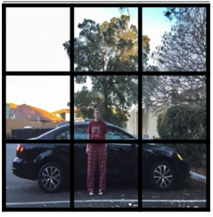</img></center>

* Note that the midpoint of the people and midpoing of the car are in almost the same place and both of them fall into the same lower middle grid cell (2, 1). 
* If we are using the old label encoding y = (Pc, bx, by, bh, bw, c1, c2, c3), it will not be able to output two detections. 
* With the idea of anchor boxes, what we are going to do is to pre-define multple different shapes called **anchor boxes** (here we are using two anchor boxes for illustration purpose) and associate two detections with the two anchor boxes.
<center>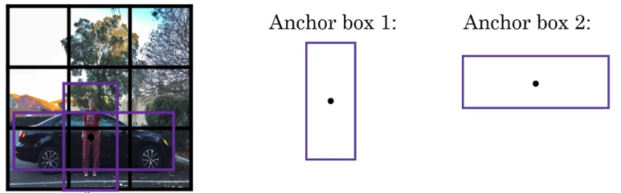</img></center>

* The training image label encoding for two anchor boxes is:
	<center>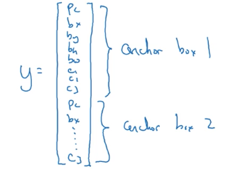</img></center>
	
	* Since we are using 2 anchor boxes, each of the 3 x 3 cells thus encodes information about 2 boxes. Anchor boxes are defined by their midpoint (x, y), width and height, and class labels. Therefore the label encoding in this particular example should have shape of (3, 3, 2, 8)
	* Here, we flattened the last two last dimensions of the shape (3, 3, 2, 8) encoding. So the output of the deep CNN is (3, 3, 16).

* With anchor box algorithm
	* Previously: Each object in training image is assigned to grid cell that contains that object's midpoint
	* With two anchor boxes: Each object in training image is assigned to grid cell that contains object's midpoint and further assigned to anchor box for that grid cell with highest IoU.

* An concrete example:
	* Let's specify label for the lower middle grid cell (2, 1) that has two anchor boxes:
	* The people is more similar to the shape of anchor box 1 while the car is more similar to the shape of anchor box 2. Therefore, the label y should be:
	<center>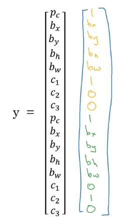</img></center>
	
	* Now, let's assume that the people in the image is gone and only car left. Then, the label y for this scenario should be:
<center>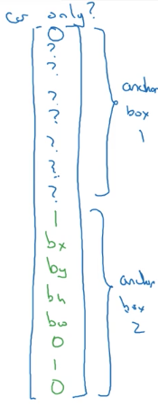</img></center>

* The anchor box algorithm can not handle two scenarios well:
	* The scenario when we have two anchor boxes but three objects in the same grid cell.
	* The scenario when two objects associated with the same grid cell and both of them have the same anchor box shape.
	* We just implement some default tiebreaker for handling both scenarios.
	
## Intersection over Union (IoU)
* IoU is a way to evaluate whether a predicted bounding box (i.e., object) is accurate or not by comparing the predicted bounding box with the ground truth bounding box.  
	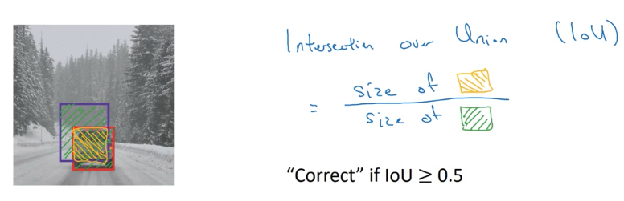</img>
	
	* In the image above, the red box is the ground truth bounding box while the blue box is the predicted bounding box by the algorithm.
	* The 0.5 is the threshold for the IoU algorithm. We can adjust this hyperparameter according to specific scenario.
	* It is used by Non-max suppression to determine whether two bounding boxes overlop with each other.
* More generally, IoU is a measure of the overlap between two bounding boxes (How similar two bounding boxes are to each other)
			
## Non-Max suppression (NMS)
* Non-max suppression is a way to make sure algorithm detects each object only once.
	* Because we are running image classification and localization algorithm on every grid cell, it is possible that many of the grid cells detect the same object with high probablity. In other words, we might end up with multiple detections of each object. 
	* What non-max suppression does is cleanning up these detections. So, we end up with just one detection per object.

<center>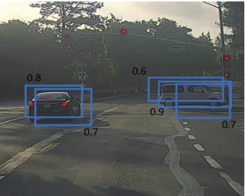</img></center>

* Non-max suppression algorithm
	* On the below 19 by 19 grid, we are going to have 19 by 19 prediction vectors, each of which is (Pc, bx, by, bh, bw) 
	<center>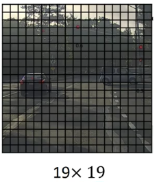</img></center>
	
	* Non-max suppression algorithm utilizes IoU 
	* The algorithm goes like:
		* For each of the 19 X 19 predictions, discard all boxes with low Pc, meaning boxes are not very confident about detecting objects (e.g., <= 0.6, we can adjust this hyperparameters). (Note that this part actually is independent from NMS. It can serve as the first filter to filter out unqualified bounding boxes)
		* While there are any remaining boxes:
			* Pick the box with the largest Pc and output that box as a prediction
			* Discard any remaining box overlapping (overlapping is determined by IoU, e.g.,IoU >= threshold) with the box picked in previous step
	* Note that for illustration purpose, we described the algorithm here for just a single class of objects on the image. For multiple object classes, we can just apply the desribed algorithm multiple times each for a class of objects. 

## YOLO (You Only Look Once)
* Read original [paper](https://arxiv.org/pdf/1506.02640.pdf)

### Construct training set
* Suppose we want to detect three class of objects: pedestrians, cars and motocycles 
* Using two anchor boxes.
* The format of training label is shown below:

<center>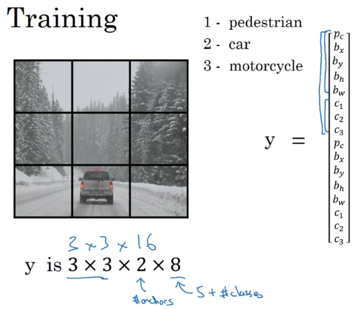</img></center>

* To construct the training set, we go through each of these nine grid cells and form the appropriate target vector y. 
	* Following shows the example of labeling top-left grid cell (0,0) and bottom-middle grid cell (2, 1).
	* There is no object in grid cell (0,0), so Pc for both anchor boxes are 0. There is a car in the grid cell (2, 1) and the car is more similar to anchor box 2 (with higher IoU). So the Pc of anchor box 1 is 0 while the P_c of anchor box 2 is 1. Accordingly, bx, by, bh, bw are filled out for anchor box 2 and the c2 for anchor box 2 is 1.
	
<center>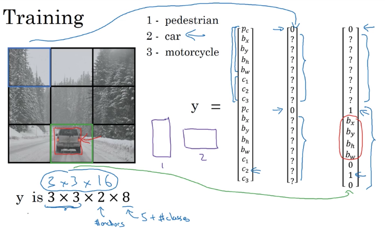</img></center>

### Train ConvNet 
* We train a convolutional neural network with output volume 3 X 3 X 16 (for this particular example)
<center>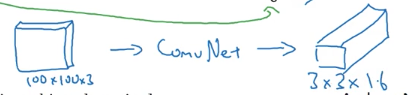</img></center>

### Make predictions
* Given an image, the neural network will output 3 X 3 X 16 volume, which contains a prediction vector with 16 units for each of the nine grid cells. 
	<center>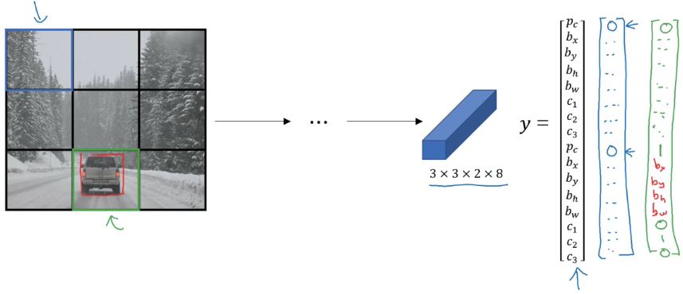</img></center>
	
	* We may encode the output as a 3 X 3 X 2 X 8 matrix
		* 3 X 3 is the grid
		* 2 indicates the number of anchor boxes.
		* 8 indicates 8 units in which 1 unit for prediction confidence (e.g. Pc), 4 units for bounding box shape (bx, by, bh, bw), 3 units for class labels (e.g., c1, c2, c3)

* Apply filters
	* If using two anchor boxes, for each of the nine grid cells, we get two predicted bounding boxes. Therefore there are 18 bounding boxes. For large grid (e.g., 19 X 19) with many predefined anchor boxes (e.g. 5), there are 19 X 19 X 5 number of bounding boxes. We may filter out some of those bounding boxes for better prediction.
	<center>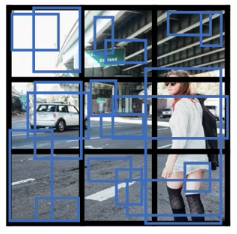</img><br/><span style='font-size:12px'>Notice that some of the bounding boxes can go outside the height and width of the grid cell that they come from</span></center>
	
	* First filter: Get rid of bounding boxes with low prediction confidence.
	* Second filter: Apply Non-Max suppresson to avoid selecting overlapping bounding boxes. 

## SSD (Single-shot multiBox Detector)
* Read original [paper](https://arxiv.org/abs/1512.02325)
* Shares many techniques with YOLO
* Huge milestone - much better than previous state-of-art approachs, which are required multiple stages (slow)
* Now we get real-time performance
* A self-driving car has to recognize objects as soon as it sees them

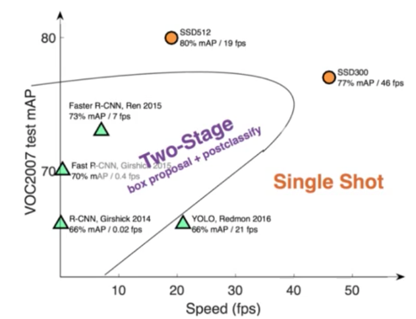</img>

