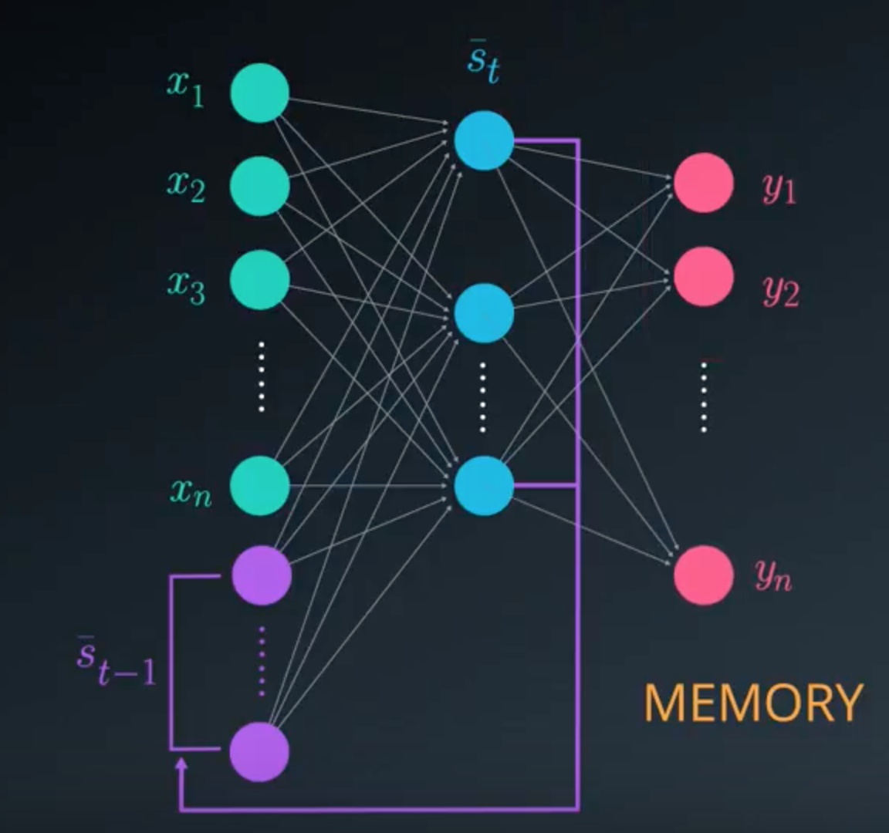
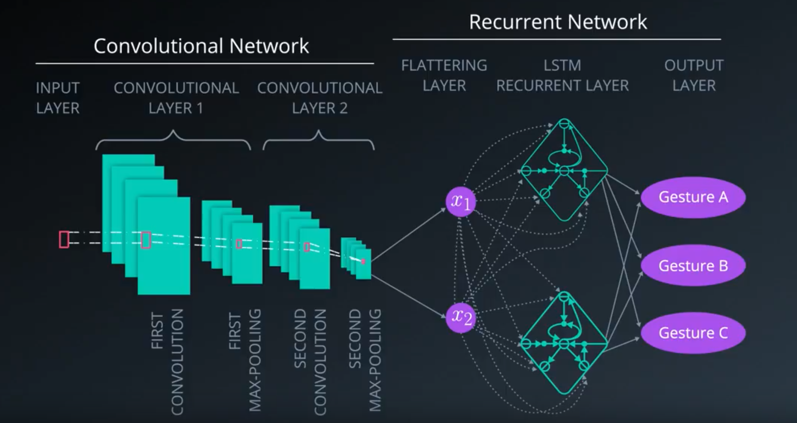

# RNN

The feedforward neural networks were trained using the current inputs only. They did not consider previous inputs when generating the current output. In other words, they did not have any memory elements. RNNs address this very basic and important issue by using memory (i.e. past inputs to the network) when producing the current output. RNN can capture `temporal dependencies`, which are dependencies over time.

`Recurrent` means occuring often or repeatedly. In RNN, we perform the same task for each element in the input sequence.  

RNNs are based on the same principles as those behind FFNNs, which is why we spent so much time reminding ourselves of the feedforward and backpropagation steps that are used in the training phase.

There are two main differences between FFNNs and RNNs. The Recurrent Neural Network uses:

1. sequences as inputs in the training phase, and
2. memory elements

> Memory is defined as the output of hidden layer neurons, which will serve as additional input to the network during next training step.

The basic three layer neural network with feedback that serve as memory inputs is called the Elman Network and is depicted in the following picture:

RNN can be combined with CNN. One can use CNN in the first few layers for the purposes of feature extraction, and then use RNNs in the final layer where memory needs to be considered. 

However RNNs have a key flaw, as capturing relationships that span more than 8 or 10 steps back is practically impossible. This flaw stems from the "vanishing gradient" problem in which the contribution of information decays geometrically over time.

What does `vanishing gradient` mean?

As you should know, while training our network we use backpropagation. In the backpropagation process we adjust our weight matrices with the use of a gradient. In the process, gradients are calculated by continuous multiplications of derivatives. The value of these derivatives may be so small that these continuous multiplications may cause the gradient to practically "vanish"

LSTM and GRU are options to overcome the Vanishing Gradient problem in RNNs. The novelty of LSTM was the idea that some signals, called states, can be kept fixed by using gates and reintroduced or not at appropriate time in the future. In this way, arbitrary time intervals an be represented and temporal dependencies can be captured. 

## Applications

There are so many interesting applications, let's look at a few more!

* Are you into gaming and bots? Check out the [DotA 2 bot by Open AI](https://blog.openai.com/dota-2/)
* How about [automatically adding sounds to silent movies?](https://www.youtube.com/watch?time_continue=1&v=0FW99AQmMc8)
* Here is a cool tool for [automatic handwriting generation](http://www.cs.toronto.edu/~graves/handwriting.cgi?text=My+name+is+Luka&style=&bias=0.15&samples=3)
* Amazon's voice to text using high quality speech recognition, [Amazon Lex](https://aws.amazon.com/lex/faqs/).
* Facebook uses RNN and LSTM technologies for [building language models](https://code.facebook.com/posts/1827693967466780/building-an-efficient-neural-language-model-over-a-billion-words/)
* Netflix also uses RNN models for [recommendations](https://arxiv.org/pdf/1511.06939.pdf)