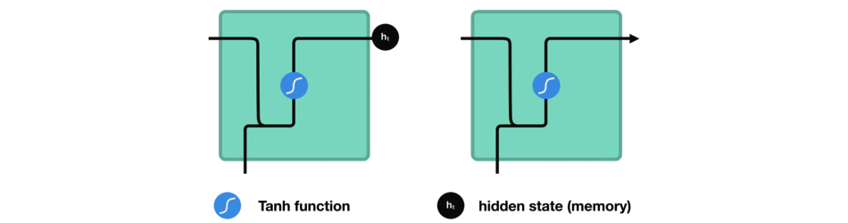
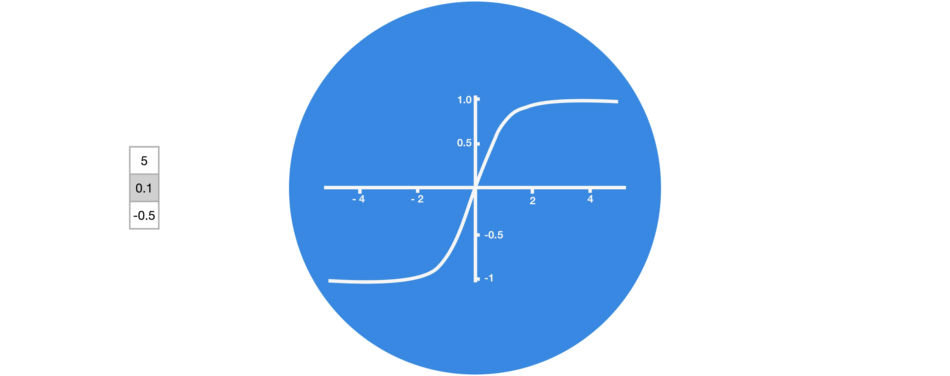
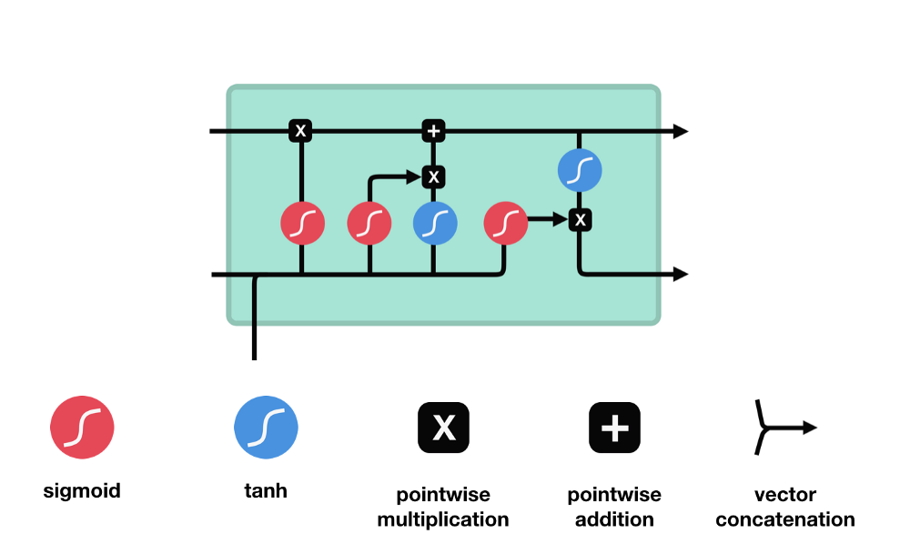
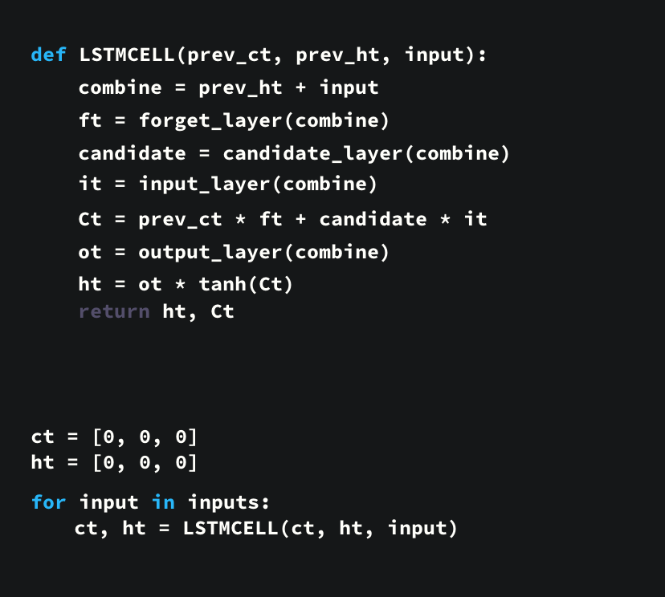

# LSTM and GRU explained

**Note**: The content of this file is basically copied from [Illustrated Guide to LSTM’s and GRU’s: A step by step explanation](https://towardsdatascience.com/illustrated-guide-to-lstms-and-gru-s-a-step-by-step-explanation-44e9eb85bf21), which did an excellent job on explaining internal mechanisms of LSTM and GRU.

## The Problem, Short-term Memory

Recurrent Neural Networks suffer from short-term memory. If a sequence is long enough, they’ll have a hard time carrying information from earlier time steps to later ones. So if you are trying to process a paragraph of text to do predictions, RNN’s may leave out important information from the beginning.

During back propagation, recurrent neural networks suffer from the vanishing gradient problem. Gradients are values used to update a neural networks weights. The vanishing gradient problem is when the gradient shrinks as it back propagates through time. If a gradient value becomes extremely small, it doesn’t contribute too much learning.

So in recurrent neural networks, layers that get a small gradient update stops learning. Those are usually the earlier layers. So because these layers don’t learn, RNN’s can forget what it seen in longer sequences, thus having a short-term memory. If you want to know more about the mechanics of recurrent neural networks in general, you can read my previous post here.

## LSTM’s and GRU’s as a solution

LSTM ’s and GRU’s were created as the solution to short-term memory. **They have internal mechanisms called gates that can regulate the flow of information**.

These gates can learn which data in a sequence is important to keep or throw away. By doing that, it can pass relevant information down the long chain of sequences to make predictions. Almost all state of the art results based on recurrent neural networks are achieved with these two networks. LSTM’s and GRU’s can be found in speech recognition, speech synthesis, and text generation. You can even use them to generate captions for videos.

## Intuition

 Let us start with a thought experiment. Let’s say you’re looking at reviews online to determine if you want to buy Life cereal (don’t ask me why). You’ll first read the review then determine if someone thought it was good or if it was bad.
 
 

When you read the review, your brain subconsciously only remembers important keywords. You pick up words like “amazing” and “perfectly balanced breakfast”. You don’t care much for words like “this”, “gave“, “all”, “should”, etc. If a friend asks you the next day what the review said, you probably wouldn’t remember it word for word. You might remember the main points though like “will definitely be buying again”. If you’re a lot like me, the other words will fade away from memory.

That is essentially what an LSTM or GRU does. It can learn to keep only relevant information to make predictions, and forget non relevant data. In this case, the words you remembered made you judge that it was good.

## Review of Recurrent Neural Networks

To understand how LSTM’s or GRU’s achieves this, let’s review the recurrent neural network. An RNN works like this; First words get transformed into machine-readable vectors. Then the RNN processes the sequence of vectors one by one.

While processing, it passes the previous hidden state to the next step of the sequence. The hidden state acts as the neural networks memory. It holds information on previous data the network has seen before.

Let’s look at a cell of the RNN to see how you would calculate the hidden state. 
* First, the input and previous hidden state are combined to form a vector. That vector now has information on the current input and previous inputs. 
* Then, the vector goes through the tanh activation, and the output is the new hidden state, or the memory of the network.

### Tanh activation
The tanh activation is used to help regulate the values flowing through the network. The tanh function squishes values to always be between -1 and 1.

When vectors are flowing through a neural network, it undergoes many transformations due to various math operations. So imagine a value that continues to be multiplied by let’s say 3. You can see how some values can explode and become astronomical, causing other values to seem insignificant.

A tanh function ensures that the values stay between -1 and 1, thus regulating the output of the neural network. You can see how the same values from above remain between the boundaries allowed by the tanh function.

RNN has very few operations internally but works pretty well given the right circumstances (like short sequences). RNN’s uses a lot less computational resources than it’s evolved variants, LSTM’s and GRU’s.

## LSTM

An LSTM has a similar control flow as a recurrent neural network. It processes data passing on information as it propagates forward. The differences are the operations within the LSTM’s cells.

These operations are used to allow the LSTM to keep or forget information. Now looking at these operations can get a little overwhelming so we’ll go over this step by step.

### Core Concept

The core concept of LSTM’s are the **cell state**, and it’s various gates. 
> The cell state act as a transport highway that transfers relative information all the way down the sequence chain. You can think of it as the “memory” of the network. 

> In theory, cell state can carry relevant information throughout the processing of the sequence. So even information from the earlier time steps can make it’s way to later time steps, reducing the effects of short-term memory. 

> As the cell state goes on its journey, information get’s added or removed to the cell state via gates. The gates are different **neural networks** that decide which information is allowed on the cell state. The gates can learn what information is relevant to keep or forget during network training.

### Sigmoid

Gates contains sigmoid activations. A sigmoid activation is similar to the tanh activation. Instead of squishing values between -1 and 1, it squishes values between 0 and 1. That is helpful to update or forget data because any number getting multiplied by 0 is 0, causing values to disappears or be “forgotten.” Any number multiplied by 1 is the same value therefore that value stay’s the same or is “kept.” The network can learn which data is not important therefore can be forgotten or which data is important to keep.

LSTM has three different gates that regulate information flow in an LSTM cell: 

* A forget gate, 
* An input gate, 
* An output gate.

### Forget Gate

The forget gate decides what information should be thrown away or kept. 

* Information from the previous hidden state and information from the current input is passed through the sigmoid function. Values come out the sigmoid function is between 0 and 1. The closer to 0 means to forget, and the closer to 1 means to keep.

### Input Gate

To update the cell state, we have the input gate. 

* First, we pass the previous hidden state and current input into a sigmoid function. That decides which values will be updated by transforming the values to be between 0 and 1. 0 means not important, and 1 means important. 
* You also pass the hidden state and current input into the tanh function to squish values between -1 and 1 to help regulate the network. 
* Then you multiply the tanh output with the sigmoid output. The sigmoid output will decide which information is important to keep from the tanh output.

### Cell State

Now we should have enough information to calculate the cell state. 

* First, previous cell state gets pointwise multiplied by the forget vector. This has a possibility of dropping values in the cell state if it gets multiplied by values near 0. 
* Then we take the output from the input gate and do a pointwise addition with modified previous cell state. This gives us our new cell state.

### Output Gate
Last we have the output gate. The output gate decides what the next hidden state should be. Remember that the hidden state contains information on previous inputs. The hidden state is also used for predictions. 

* First, we pass the previous hidden state and the current input into a sigmoid function. 
* Then we pass the new cell state to the tanh function. We multiply the tanh output with the sigmoid output to decide what information the hidden state should carry. 
* The output is the hidden state. The new cell state and the new hidden is then carried over to the next time step.

To review:

* the Forget gate decides what is relevant to keep from prior steps. 
* the Input gate decides what information is relevant to add from the current step. 
* the Output gate determines what the next hidden state should be.

### Code Demo

For those of you who understand better through seeing the code, here is an example using python pseudo code.

1. First, the previous hidden state and the current input get concatenated. We’ll call it **combine**.
2. **Combine** get’s fed into the forget layer. This layer removes non-relevant data.
3. A candidate layer is created using **combine**. The candidate holds possible values to add to the cell state.
4. **Combine** also get’s fed into the input layer. This layer decides what data from the candidate should be added to the new cell state.
5. After computing the forget layer, candidate layer, and the input layer, the current cell state is calculated using those vectors and the previous cell state.
6. The output layer is then computed based on the **combine**.
7. Pointwise multiplying the output layer with the new cell state gives us the new hidden state.

To sum up, the control flow of an LSTM network are a few tensor operations and a for loop. You can use the hidden states for predictions. Combining all those mechanisms, an LSTM can choose which information is relevant to remember or forget during sequence processing.

## GRU

Now let us briefly look at the GRU. The GRU is the newer generation of Recurrent Neural networks and is pretty similar to an LSTM. GRU’s got rid of the cell state and used the hidden state to transfer information. It also only has two gates, a reset gate and update gate.

### Update Gate

The update gate acts similar to the forget and input gate of an LSTM. It decides what information to throw away and what new information to add.

### Reset Gate

The reset gate is another gate is used to decide how much past information to forget.

GRU has fewer tensor operations; therefore, they are a little speedier to train then LSTM’s. There isn’t a clear winner which one is better. Researchers and engineers usually try both to determine which one works better for their use case.

## Conclusion

To sum up, RNN’s are good for processing sequence data for predictions but suffers from short-term memory. LSTM’s and GRU’s were created as a method to mitigate short-term memory using mechanisms called gates. Gates are just neural networks that regulate the flow of information flowing through the sequence chain. LSTM’s and GRU’s are used in state of the art deep learning applications like speech recognition, speech synthesis, natural language understanding, etc.

## Resources

If you’re interested in going deeper, here are links of some fantastic resources that can give you a different perspective in understanding LSTM’s and GRU’s. This post was heavily inspired by them.

http://www.wildml.com/2015/10/recurrent-neural-network-tutorial-part-4-implementing-a-grulstm-rnn-with-python-and-theano

http://colah.github.io/posts/2015-08-Understanding-LSTMs/

https://www.youtube.com/watch?v=WCUNPb-5EYI

https://towardsdatascience.com/animated-rnn-lstm-and-gru-ef124d06cf45

